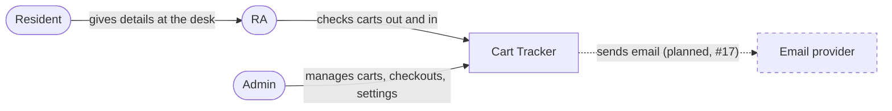
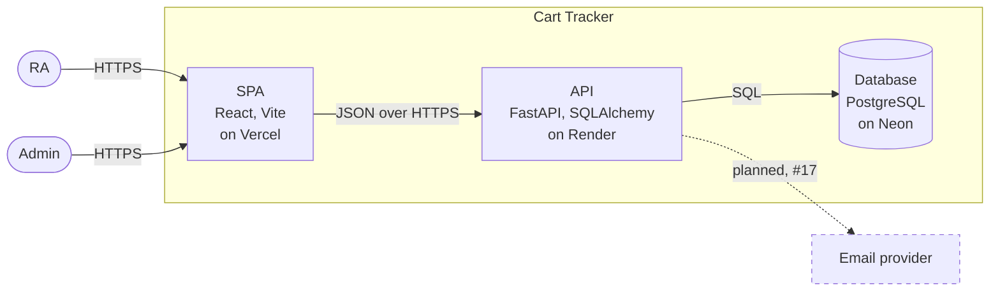
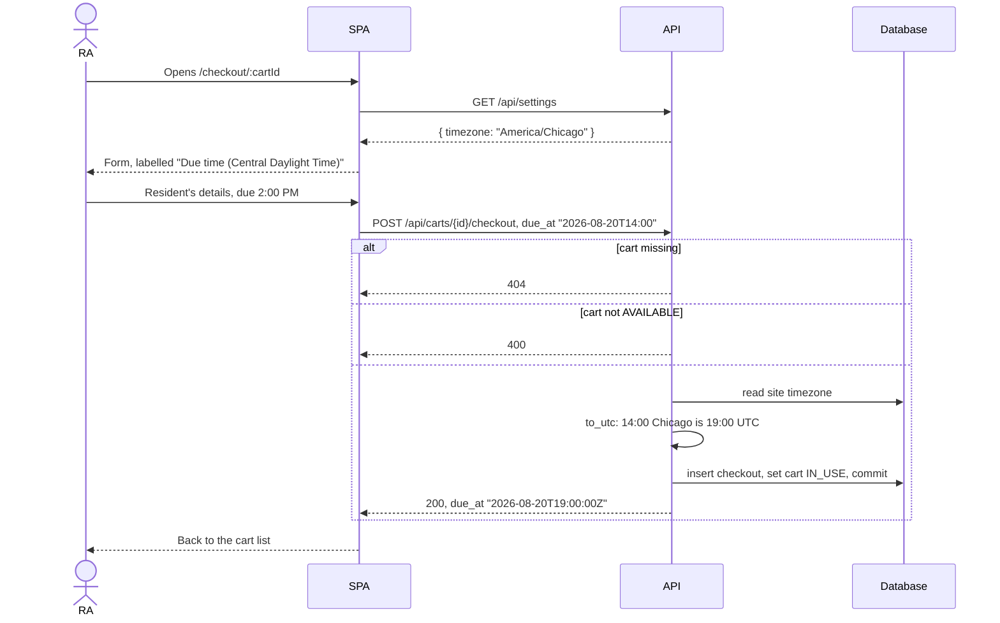

# Architectural design

**Project:** Move-In Day Cart Tracker
**Version:** 0.1

The one map of the whole system: its parts, the external systems it talks to, and the decisions
that are expensive to change. How a single feature works inside it is a design-of-record in this
folder ([overdue.md](overdue.md), [notifications.md](notifications.md)).

The sections follow arc42's numbering. Sections that a solo project with no client specification
doesn't need are kept as one-line pointers so the numbering still matches.

## Identifiers

| Space | For |
|---|---|
| `KD-<slug>` | Key architectural decisions (section 9) |
| `QS-<slug>` | Quality scenarios (section 10) |
| `RISK-<slug>` | Technical risks (section 11) |
| `TD-<slug>` | Technical debt the system knowingly carries (section 11) |

Business rules (`BR-*`) and open issues (`OI-*`) are cited from [docs/requirements](../requirements/).

## Revision history

| Version | Date | Change |
|---|---|---|
| 0.1 | 2026-10-08 | First version, written from the code at `e38545f` after M1 to M4 shipped |

---

## 1. Introduction and Goals

### 1.1 Requirements overview

The [README](../../README.md) says what the app does. The behavior it enforces is in the
[business rules](../requirements/business-rules.md).

### 1.2 Quality goals

| Priority | Quality goal | Why it shapes the architecture |
|---|---|---|
| 1 | **A due time means the same moment everywhere** | The app's one job is knowing when a cart is due back. A due time that shifts with a server, a browser, or a setting is a wrong answer at the desk. Drives `KD-utc-storage`. |
| 2 | **The desk is fast and has no friction** | On move-in day an RA checks carts out to a queue of families. No login, one form, one tap to return (`BR-desk-no-login`). |
| 3 | **Runs for free with nobody operating it** | One developer, no budget, used a few days a year. Drives `KD-deployment-shape`. |

### 1.3 Stakeholders

RAs at the desk, admins (residence-life staff with the shared password), and residents, who never
use the app directly. See the [glossary](../requirements/project-glossary.md#people).

## 2. Architecture Constraints

- **No budget:** every hosted piece runs on a free plan.
- **One maintainer**, who is also learning the stack. Fewer moving parts beats a more scalable design.

The stack itself is a decision, not a constraint; see section 9.

## 3. Context and Scope

People are rounded; dashed means planned. Today the system talks to no external system at runtime.
The email provider arrives with #17, and whether it emails residents is `OI-4`. Residents never use
the app; an RA enters their details.

## 4. Solution Strategy

- **Three containers on three free hosts**: a static SPA, an API, and a managed database (`KD-deployment-shape`, quality goal 3).
- **The API is the only gate.** Every rule is enforced there; the frontend only hides what a user can't do (section 8.1).
- **Store instants, apply one site timezone only at the edges** (`KD-utc-storage`, quality goal 1).
- **One shared admin secret instead of user accounts** (`KD-shared-admin-password`, quality goals 2 and 3).

## 5. Building Block View

### 5.1 Containers

| Container | Holds |
|---|---|
| SPA | The cart list, checkout form, and admin page. Admin calls carry a Bearer token. |
| API | Every business rule, and the admin gate (`require_admin`). |
| Database | Carts, checkouts, and settings. |

The SPA is separate from the API because Vercel serves static files for free and the API host
doesn't need to. There's one API and one database because nothing in section 1.2 needs more
(`KD-deployment-shape`).

### 5.2 Use case areas and components

| Area | Component | Responsibility | Code | Depends on | Status |
|---|---|---|---|---|---|
| Desk | Carts | Lists carts; checks out and returns them | `app/routers/carts.py`, `CartList.jsx`, `CheckoutForm.jsx` | Settings | built |
| Admin | Admin | Cart inventory, active checkouts and history, due-time edits, force return | `app/routers/admin.py`, `Admin*.jsx` | Auth, Carts (`close_session`), Settings | built |
| Admin | Overdue | Decides which checkouts are overdue | [overdue.md](overdue.md) | Admin | planned, #16 |
| Admin | Notifications | Sends every email the system sends | [notifications.md](notifications.md) | Overdue, email provider | planned, #17, blocked on `OI-4` |
| (cross-cutting) | Auth | Trades the shared password for a token; `require_admin` | `app/auth.py`, `frontend/src/auth.js` | none | built |
| (cross-cutting) | Settings and time | The site timezone; converting times in and out | `app/routers/settings.py`, `app/timezones.py`, `frontend/src/time.js` | none | built |

## 6. Runtime View

### Checking out a cart

The one flow every quality goal touches.

The site timezone is read twice, once when the form loads and again when the request arrives. If
an admin changes it in between, the two disagree (`OI-7`, `TD-wall-clock-due-times`).

## 7. Deployment View

| Container | Production | Development |
|---|---|---|
| SPA | Vercel, built from `frontend/`; `vercel.json` rewrites every path to `index.html` so deep links work | `npm run dev` on port 5173 |
| API | Render, at `cart-management-967g.onrender.com` | `uvicorn app.main:app --reload` on port 8000 |
| Database | Neon PostgreSQL | `DATABASE_URL` in a local `.env`; tests use SQLite |

**How a change gets there.** A pull request merges into `main`. GitHub Actions
(`.github/workflows/test.yml`) runs `pytest`, and only if it passes calls Render's deploy hook.
Vercel builds the frontend from the repository through its own GitHub integration, configured in
Vercel rather than in this repo. Tests run only after a merge, not on the pull request
(`TD-ci-after-merge`).

**Schema changes.** `Base.metadata.create_all` runs at API startup and creates missing tables. It
never alters an existing one, so a column change is a manual change on Neon (`KD-no-migrations`).

**What survives a restart.** Everything that matters is in Neon. Admin tokens are signed, not
stored, so they survive an API restart and stay valid until they expire. The admin's token lives in the
browser's `localStorage`.

## 8. Crosscutting Concepts

### 8.1 Security

**Trust boundary.** The API. The browser and everything in it, including the SPA's `RequireAdmin`
guard, is outside. Every admin route is under `/api/admin` on a router that applies `require_admin`
to all of its routes, so a new admin endpoint can't ship unprotected. Login is on a separate public
router.

**Authentication.** One shared password (`ADMIN_PASSWORD`), compared in constant time, is traded
for an HS256 JWT signed with `ADMIN_JWT_SECRET` and valid for 8 hours (`BR-shared-admin-password`).
The SPA keeps it in `localStorage` and sends it as a Bearer token.

**Authorization.** One role. The public API (list carts, settings, check out, return) is open by
design (`BR-desk-no-login`); anyone who finds the API's URL can check out or return any cart
(`RISK-open-desk-api`).

**Sensitive data.** Residents' names, phone numbers, and room numbers are stored in Neon and returned
only by admin endpoints and by the checkout response to whoever made the checkout. They are kept
until their cart is deleted (`TD-resident-data-kept-forever`).

**Secrets** live in Render's environment (`DATABASE_URL`, `ADMIN_PASSWORD`, `ADMIN_JWT_SECRET`) and
GitHub Actions secrets (`RENDER_DEPLOY_HOOK_URL`), never in the repository. `VITE_API_URL` is public
and is built into the SPA.

### 8.2 Other concepts

#### 8.2.1 Time and time zones

Every timestamp is stored as naive UTC from `utc_now()`, never from a database default or
`datetime.now()`. A time with no offset is a wall-clock time in the site timezone; a time with an
offset is an exact instant; both go through `to_utc()`. Responses add a `Z` (`UTCDateTime`), and the
SPA formats every time in the site timezone through `frontend/src/time.js`, never the browser's.
Why: a due time has to mean the same moment wherever the server, the database, or the viewer is
(quality goal 1). Shown in: `app/timezones.py`, `app/schemas.py`. Known gaps: `OI-6` to `OI-11`,
summarized in [OPEN-ISSUES.md](../requirements/OPEN-ISSUES.md#timezone-handling). Tests can't set the
clock (`TD-no-clock-injection`).

#### 8.2.2 Error handling

Routes raise FastAPI's `HTTPException`, so every error is `{"detail": "..."}` with `404` for a missing
record, `400` for a rule the request breaks, `401` for a missing or bad token, and `422` from
Pydantic for a malformed body. The SPA logs failures to the console and shows the user nothing
(`TD-silent-frontend-errors`).

#### 8.2.3 API conventions

Public routes are under `/api`, admin routes under `/api/admin`. Lists are filtered with query
parameters (`status`, and `overdue` from #16) rather than separate endpoints.

#### 8.2.4 Validation

Pydantic models in `app/schemas.py` are the check that counts. The form's `required` attributes
only save a round trip.

#### 8.2.5 Configuration and secrets

Everything that differs between environments is an environment variable, read with `os.getenv` or
`os.environ`; `DATABASE_URL` has no default, so a missing one fails at startup. The CORS allowlist
(localhost:5173 and the Vercel URL) is in `app/main.py`.

#### 8.2.6 Persistence and concurrency

One SQLAlchemy session per request from `get_db`, committed in the route. Nothing locks a row, so
two simultaneous checkouts of one cart can both succeed (`RISK-concurrent-checkout`).

#### 8.2.7 Testing

`pytest` with FastAPI's `TestClient` against SQLite, swapped in with
`app.dependency_overrides[get_db]`; admin secrets are set with `monkeypatch`. Every endpoint and
failure path gets a test. Behavior that only Postgres shows, such as concurrency, isn't covered.

#### 8.2.8 Logging and auditing

No application logging beyond Uvicorn's access log, and no audit trail: nothing records which admin
force-returned a cart or changed a due time, and with a shared password there's no "which" to record.

#### 8.2.9 Code conventions

Naming and case styles for every kind of identifier, and the rules for comments, messages, and UI
text, are in the Writing section of [`CLAUDE.md`](../../CLAUDE.md#writing), which every agent
session reads.

## 9. Architecture Decisions

These decisions were reconstructed from the code and its history on 2026-10-08, after they were
made. Each needs the owner's confirmation; a reason the owner doesn't recognize should be replaced
with the real one.

### 9.1 Architecturally significant requirements

| Rank | Requirement | Drives |
|---|---|---|
| 1 | A due time means the same moment everywhere (quality goal 1) | `KD-utc-storage` |
| 2 | Free, with nobody to operate it (quality goal 3) | `KD-deployment-shape`, `KD-neon-database`, `KD-no-migrations` |
| 3 | Admin data is protected, the desk is not (quality goal 2, `BR-desk-no-login`) | `KD-shared-admin-password` |

### 9.2 Key decisions

**`KD-deployment-shape`: a static SPA, one API, one managed database.** Accepted.
- **Context:** One developer, a few days of real use a year, no budget.
- **Decision:** The SPA on Vercel, the API on Render, Postgres on Neon, each on a free plan.
- **Rejected:** Serving the SPA from the API, which puts the static files on the host that may be
  asleep (`RISK-render-cold-start`). Splitting the API into services, which nothing needs.
- **Trade-off:** Three dashboards and a CORS allowlist to keep in sync.

**`KD-shared-admin-password`: one shared password, traded for a JWT.** Accepted.
- **Context:** A handful of staff, one role, a short event.
- **Decision:** `ADMIN_PASSWORD` in the environment, an 8-hour token, no user table.
- **Rejected:** User accounts. They mean signup, password reset, and roles for a few people over a
  weekend.
- **Trade-off:** No audit trail of who did what (8.2.8). Changing the password means updating
  Render and telling everyone.

**`KD-utc-storage`: store UTC instants; one site timezone, applied only at the edges.** Accepted.
- **Context:** The server, the database, and the browsers may each be in a different timezone.
- **Decision:** Naive UTC in every column from `utc_now()`; the site timezone applied when a time
  is typed or shown.
- **Rejected:** Storing local times, which change meaning when the timezone setting does. Using
  each browser's own timezone, which shows the same due time differently on two devices.
- **Trade-off:** Exactly one timezone (`TD-single-site-timezone`, `OI-6`).

**`KD-neon-database`: PostgreSQL on Neon.** Accepted.
- **Decision:** A Neon Postgres database, with `pool_pre_ping=True` because Neon closes idle
  connections.
- **Rejected:** Render's own Postgres. _[Owner: confirm the reason. Likely that Render's free
  database expires after a trial period, while Neon's free tier doesn't.]_
- **Trade-off:** The API and database are with different providers, so every query crosses the
  internet.

**`KD-no-migrations`: tables from `create_all`, no migration tool.** Accepted.
- **Decision:** `Base.metadata.create_all` at startup.
- **Rejected:** Alembic, which is setup and a second thing to learn for a schema that has changed
  rarely.
- **Trade-off:** A column change on an existing table is a manual change on Neon. #17 may add the
  first ones (`notifications.md`); revisit this decision then.

## 10. Quality Requirements

### 10.1 Quality requirements overview

The quality goals in section 1.2 are the overview.

### 10.2 Quality scenarios

| ID | Source and stimulus | Environment | Response | Measure | Verified by |
|---|---|---|---|---|---|
| `QS-due-time-site-zone` | An RA types a due time with no offset | Site timezone is not the server's | Stored as that wall-clock time in the site timezone | 18:00 in `America/Denver` in June is stored as 00:00 UTC the next day | `test_checkout_due_at_uses_site_timezone` |
| `QS-offset-due-time-exact` | An admin sends a due time with an offset | Any site timezone | Stored as that exact instant | The site timezone is ignored | `test_admin_update_due_at_with_offset_ignores_site_timezone` |
| `QS-admin-route-denied` | A request to an admin route without a token | Normal operation | Refused before the route runs | `401` | `test_update_timezone_requires_token` and the other `*_requires_token` tests |
| `QS-overdue-consistent` | Two devices with different clocks open the admin page | A checkout has just passed its due time | Both show the same checkouts as overdue | Within one 30-second refresh | Not yet; [overdue.md](overdue.md) |

## 11. Risks and Technical Debt

| ID | Type | What could go wrong, and what it breaks | Mitigation or fix | Cites |
|---|---|---|---|---|
| `RISK-concurrent-checkout` | Risk | Two RAs tap Checkout on the same cart at once. Both requests read `AVAILABLE`, both insert a checkout, and the cart has two active checkouts, breaking `BR-one-active-checkout`. Return then closes only one of them. | Make the status change conditional: `UPDATE carts SET status='IN_USE' WHERE id=? AND status='AVAILABLE'`, and refuse when no row changed. Or lock the row with `with_for_update()`. | `BR-one-active-checkout` |
| `RISK-render-cold-start` | Risk | If the API is on Render's free plan, it spins down when idle, and the first request after that takes many seconds. The first RA of the morning sees a hung page. | Open the app once before the desk opens; or a paid plan for move-in week. | `KD-deployment-shape` |
| `RISK-open-desk-api` | Risk | Anyone who finds the API's URL can check out or return any cart, or flood the list with checkouts. | Accepted for move-in day. If it's abused, a shared desk code like the admin password. | `BR-desk-no-login` |
| `TD-single-site-timezone` | Debt | One timezone for the whole app. A second location can't be supported without a schema change. | Answer `OI-6` first. | `BR-site-timezone`, `OI-6` |
| `TD-wall-clock-due-times` | Debt | The SPA sends due times as wall-clock text, and the API reads them in whatever the site timezone is when the request arrives. A timezone change while a form is open shifts the due time. | Send an instant with an offset from the SPA, which already knows the zone it labelled. | `OI-7` |
| `TD-no-clock-injection` | Debt | `utc_now()` can't be set from a test, so time-based tests rely on the API accepting past due times. | Patch `utc_now` where a test needs a fixed clock. | `OI-5`, [overdue.md](overdue.md#tests) |
| `TD-resident-data-kept-forever` | Debt | Residents' names, phone numbers, and room numbers are never deleted unless their cart is. | A cleanup after move-in, or an admin "clear history" action. | 8.1 |
| `TD-ci-after-merge` | Debt | Tests run on push to `main`, not on pull requests, so a failing change is merged before anyone sees it fail. The deploy is still blocked. | Add `pull_request` to the workflow's triggers, and keep the deploy step on `main` only. | 7 |
| `TD-silent-frontend-errors` | Debt | A failed checkout or return only logs to the console. The RA sees nothing happen. | Show the API's `detail` message on the page. | 8.2.2 |

## 12. Glossary

See the [project glossary](../requirements/project-glossary.md).
