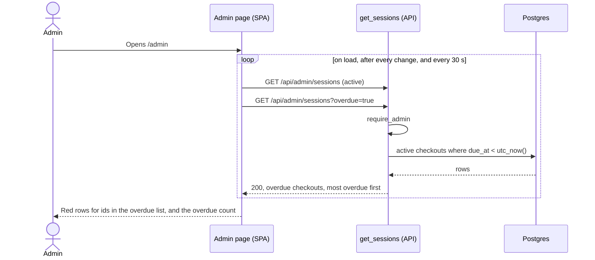

# Overdue design

**Area:** Overdue checkouts, issue #16

> **Realizes:** #16; `BR-overdue-server-decides`
> **Depends on:** `BR-overdue-definition`, `BR-store-utc`, `BR-one-active-checkout`, `BR-cart-admin-only`
> **See:** [business rules](../requirements/business-rules.md), [architecture](architectural-design.md), [open issues](../requirements/OPEN-ISSUES.md)
> **Designed against:** `e38545f`

**Status:** Draft. Nobody builds from it until it is merged.

---

## Overview

The admin page highlights and counts overdue checkouts. Today the browser decides which ones are
overdue by comparing `due_at` with the device's clock (`isOverdue()` in
`frontend/src/sessions.js`), so two devices with different clocks can disagree. This design moves
the decision to the API (`BR-overdue-server-decides`): the Admin component gains an `overdue`
filter on `GET /api/admin/sessions`, and the admin page shows what that filter returns. It lives in
the API and SPA containers ([5.1](architectural-design.md#51-containers)) and reads only the
`sessions` table.

Out of scope: overdue carts on the public cart list (`OI-2`) and a grace period (`OI-3`). Each one
extends this design if the answer is "yes".

## Components & classes

- `app/routers/admin.py`, `get_sessions` (**changed**): takes `overdue: bool = False` and, when
  true, adds `returned_at IS NULL AND due_at < utc_now()` to the query.
- `frontend/src/components/AdminPage.jsx` (**changed**): fetches the overdue list alongside the
  active list in `refresh()`, and calls `refresh()` on the 30-second timer that today only
  re-renders. The overdue count is the length of the overdue list.
- `frontend/src/components/AdminSessions.jsx` (**changed**): a row is highlighted when its id is in
  the overdue list, not when the device clock says so.
- `frontend/src/sessions.js` (**removed**): `isOverdue()` has no callers left.
- `app/timezones.py`, `utc_now()` (**reused**): the only source of "now".

## Sequence

### Admin page shows overdue checkouts

## API contract

| Endpoint | Caller | Request | Success | Errors |
|---|---|---|---|---|
| `GET /api/admin/sessions?overdue=true` | Admin token | `overdue` (bool, default `false`), combined with the existing `status` (default `active`) | `200`: the checkouts that match both filters, as `ActiveSessionResponse`, in each `status` value's existing order (soonest due first for `active`, so the most overdue is first) | No or expired token: `401`. `overdue` not a boolean: `422`. |

**How `overdue` and `status` combine.** Both are filters, applied together. An overdue checkout is
always active, so `status=returned&overdue=true` returns `[]` (not an error), and
`status=all&overdue=true` returns the same rows as `status=active&overdue=true`.
`overdue=false` means "don't filter", not "only checkouts that aren't overdue".

## Key decisions

**A filter, not a field.** `?overdue=true` returns the overdue checkouts; the response shape
doesn't change. Rejected: an `is_overdue` field on every checkout. The owner chose the filter on
2026-10-08 (`OI-1`). It also keeps the definition in one query, which #17 can reuse to find whom
to email.

**The admin page refetches every 30 seconds instead of checking the device clock.** This is what
makes every device agree. Cost: a checkout turns red up to 30 seconds after its due time, plus the
request time. Rejected: keeping the device-clock check as a fallback between refetches, because two
rules would disagree exactly when it matters, at the moment a cart becomes due. Rejected: pushing
updates over WebSockets or server-sent events, which is a second protocol to solve a 30-second delay
nobody has asked to remove.

**"Minutes overdue" is still computed on the device.** The label `(12 min overdue)` uses
`now - due_at` in the browser, clamped at 0 so a slow device clock never shows a negative number
for a row the API says is overdue. Only whether a row is overdue has to agree across devices; the
size of the number is informational. Rejected: returning the server's time with every response,
which adds a field for a cosmetic label.

**Strictly later, no grace period.** `due_at < utc_now()`, matching `BR-overdue-definition`. A
grace period (`OI-3`) would change only this comparison.

## Data model

No change. The filter reads existing columns, and the table holds tens of rows on move-in day, so
there's no index on `due_at`.

## Reuse & cross-cutting

- `require_admin`, already applied to the whole admin router ([8.1](architectural-design.md#81-security)).
- `utc_now()` for "now", never `datetime.now()` or a database clock ([8.2.1](architectural-design.md#821-time-and-time-zones)).
- `_to_response()` for the response shape.

## Tests

Tests make a past-due checkout by checking out with a `due_at` an hour in the past, which the API
accepts today (`OI-5`). If `OI-5` makes checkout reject past times, these tests create the
checkout with a future time and move it into the past with the admin `PATCH`.

| Flow | Level | Asserts |
|---|---|---|
| Main | integration | `?overdue=true` returns an active checkout whose due time has passed |
| Not yet due | integration | An active checkout due in the future is not returned |
| Returned | integration | A returned checkout whose due time had passed is not returned |
| With `status=returned` | integration | `status=returned&overdue=true` returns `[]` |
| With `status=all` | integration | Returns only the active overdue checkouts |
| Default | integration | Omitting `overdue`, or `overdue=false`, returns the same as today |
| Order | integration | Two overdue checkouts come back most overdue first |
| Auth | integration | No token: `401` |
| Bad value | integration | `overdue=maybe`: `422` |

Today the API ignores query parameters it doesn't know, so `?overdue=true` returns `200` with
every active checkout (checked against the running API on 2026-10-09). Deploy the API change before
the frontend change, or every active checkout shows as overdue with no error.

The frontend has no automated tests. The page is checked by hand: a checkout due one minute from
now turns red within 30 seconds of its due time, without a reload.

## Changes to the architecture-of-record

None. The Overdue component is already listed in [5.2](architectural-design.md#52-use-case-areas-and-components)
as planned; it becomes `built` when this ships.

## Open questions & risks

- `OI-2`: overdue on the public list. Needs a public endpoint, since this one is admin-only.
- `OI-3`: grace period.
- `OI-5`: past due times at checkout; changes how the tests make an overdue checkout.
- Accepted risk: a red row lags the due time by up to 30 seconds.
- Deploy order: the API first (see [Tests](#tests)). A frontend that ships first marks every active checkout overdue.
